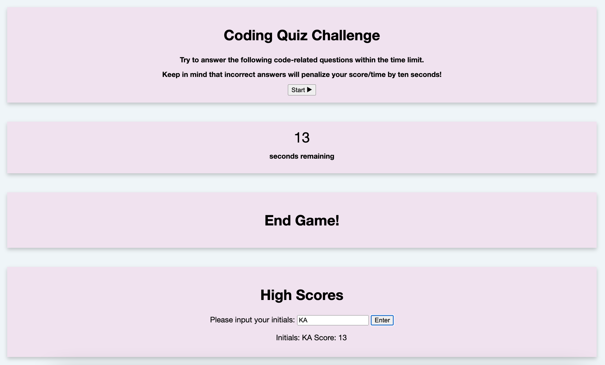

## Project: CODING QUIZ

## Description

The objective of this website is to create a quiz for coding questions. The user may use this for studying or testing their coding knowledge. The below criteria was kept in mind when creating this quiz:

GIVEN I am taking a code quiz
WHEN I click the start button
THEN a timer starts and I am presented with a question
WHEN I answer a question
THEN I am presented with another question
WHEN I answer a question incorrectly
THEN time is subtracted from the clock
WHEN all questions are answered or the timer reaches 0
THEN the game is over
WHEN the game is over
THEN I can save my initials and score

## Installation

The HTML, CSS, and JavaScript code can be downloaded via the Homework-04 folder on my Github page. It can also be viewed by visiting the following URL: https://kristinaama.github.io/Coding-Quiz/

## Usage

This coding quiz challenge is intended for easy viewing and navigation. Click the "Start" button on the page to begin the quiz, and answer the questions that appear on the screen before the timer runs out. If an answer is incorrect, the timer will decrease by 10 seconds. Scores will be recorded in the "High Scores" section.

## Credits

Samantha Rudolph - UC Berkeley Extension Instructor

Armando Osorio - UC Berkeley Extension Tutor

## License

Please refer to MIT license.
